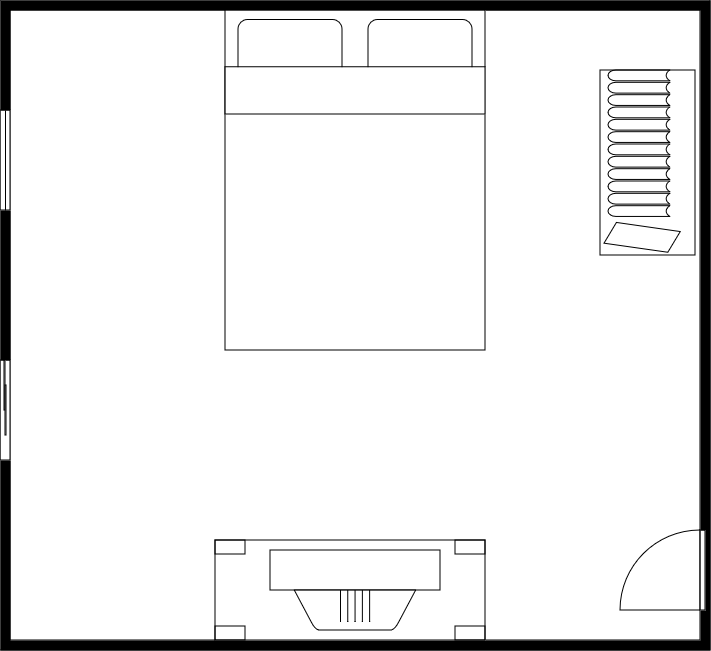

<link rel="stylesheet" href="https://unpkg.com/leaflet@1.7.1/dist/leaflet.css" />

# Unit One : Numbers and operations on them
## Lesson Two : Applications of Ratio and Proportion (First) Scale Drawing  

### Concept of Scale Drawing  

**It is a ratio of the dimention in the drawing or model to the dimention in reality**  

### Example 1  

a. if the distance between two cities is 80 km and the the distance between them on the map is 4 cm, find the scale drawing for this map  

$The \, scale \, drawing \, = \frac{The \, length \, in \, the \, drawing}{the \, real \, length}$  

$= \frac{4 \, cm}{80 \, Km} = \frac{4}{8,000,000} = \frac{1}{2,000,000}$  

The scale drawing can be written as 1 : 2,000,000

b. An enlarged picture of an insect, its real length is 0.5 mm and its length in the picture is 7.5 cm, find the scale drawing.
   The length in the drawing = 
  $7.5 \, cm = 7.5 \times 10 \, mm = 75 \, mm$  
  $Ratio = \frac{75}{0.5} = \frac{75 \times 10}{0.5 \times 10} = \frac{750}{5} = \frac{750 \div 5}{5 \div 5} = \frac{150}{1}$
   
   That means every 150 mm in the drawing = 1 mm in the real **150:1**

### Note  
if the scale drawing is **greater than 1** the scale drawing for **magnification**  
Such as: 100: 1 , 350 : 1  

if the scale drawing is **Less than 1** the scale drawing for **minimization**  
Such as: 1 : 300 , 1 : 750  

### Example 2  

if the scale drawing in the map is 1 : 500,000 and the distance between two cities on the map is 3 cm, find the real distance between the two cities.  

**Solution**  

$The \, scale \, drawing = \frac{The \, distance \, on \, the \, map}{the \, real \, distance}$  
 
$\frac{1}{500,000} = \frac{3 \, cm}{The \ , real \, distance}$  
 
$The\,real\,distance = \frac{3\,cm \times 500,000}{1} = 1,500,000\,cm = \frac{1,500,000}{100,000} = 15 \, km$  

### Example 3  

if the distanc between two cities is 24 km, then find the distance in **cm** between the two cities on a map given that the scale drawing of the map is 1 : 400,000  

**Solution**  

$The \, scale \, drawing = \frac{The \, distance \, on \, the \, map}{the \, real \, distance}$  

$\frac{1}{400,000} = \frac{The \, distance \, on \, the \, map}{24 \times 100,000 \, cm}$

$The \, distance \, on \, the \, map = \frac{24 \times 100,000 \times 1}{400,000} = 6 \, cm$  

**Note**  
The scale drawing on map can be expressed as follow  

  

    

    0 km
  

  

    

    20 km
  

  

    

    40 km
  

  

    

    60 km
  

  

    

    80 km
  

  

    

    100 km
  

  
   
  

this means that every 1 cm on the map represent 20 km in reality  

### Example 4  

use the ruler to measure the distance between Cairo and Alexandria on the map, and use the map scale to find the actual distance between Cairo and Alexandria.  

  

    

    0 km
  

  

    

    55 km
  

  

    

    110 km
  

  

    

    165 km
  

  

    

    220 km
  

  

    

    275 km
  

  
   

  

   

**Solution**  

the distance on the map = 4 cm  
$\frac{1\,cm}{55\,km} = \frac{4\,cm}{X}$  

$X = \frac{4 \times 55}{1} = 220 \, km$

### Example 5  

the figure represent a model of square room wuth a side length of 4 cm, where every i cm in the model represent $1 \frac{1}{2}$ in reality.
calculate the real area of the room.  

**Solution**

The drawing scale = $\frac{The \,model\,length}{The\,real\,length}$  

$\frac{1 \, cm}{1 \frac{1}{2}\,m} = \frac{4\,cm}{The\, real\,side\, length}$  

The real side length = $\frac{4 \times 1 \frac{1}{2}}{1} = 6\, m$  

[def]: /docs/assets/room.png

